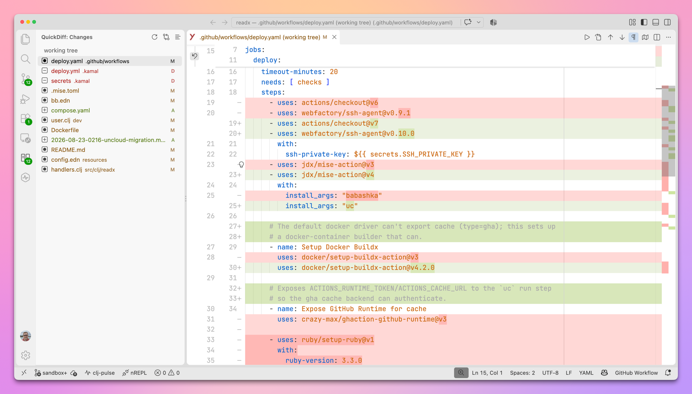
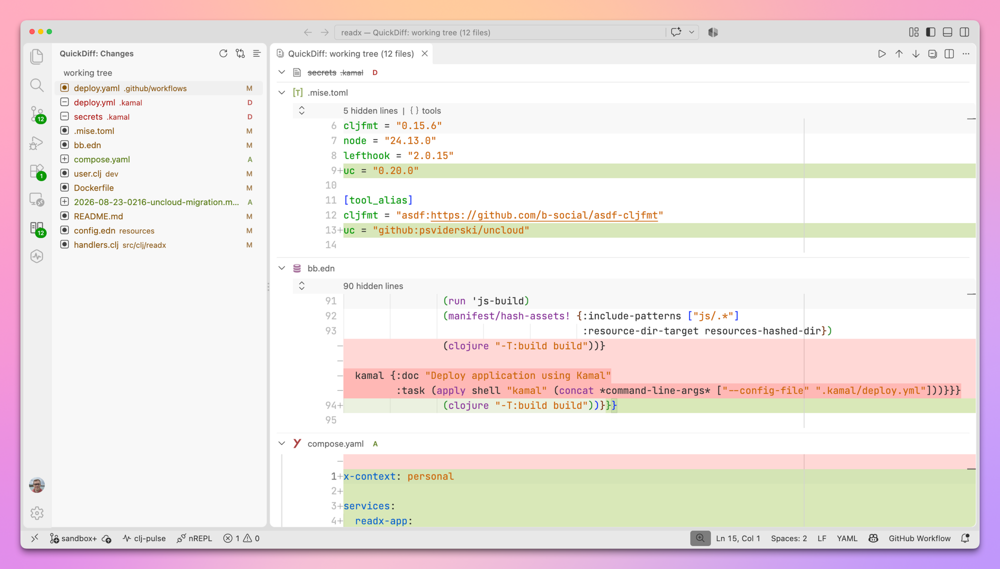

<p align="center"></p>

# QuickDiff

A minimal, keyboard-first diff viewer for VS Code.

Open a repository and see what changed. Move between files and changes from the keyboard. QuickDiff lists changed files in its own sidebar and opens them in VS Code's native diff editor. There is no staging, no comments, and no review workflow.



## Install

Install **QuickDiff** from the Extensions view (search for "QuickDiff"), or from the command line:

```sh
code --install-extension abogoyavlensky.quickdiff
```

Each version is also attached as a `.vsix` to the [GitHub releases](https://github.com/abogoyavlensky/quickdiff/releases). Install it with `code --install-extension quickdiff-<version>.vsix`.

QuickDiff requires VS Code 1.95 or newer and uses the built-in Git extension.

## Sidebar and modes

The QuickDiff icon in the activity bar opens the **Changes** list: one row per file, sorted by path, with a status icon and Git colors. The line above the list shows the current mode and the badge shows the number of files. Click a file to open its diff at the first change.

There are four modes. Switch with **QuickDiff: Pick Mode** or the view title button:

| Mode | Compares | Use it for |
|------|----------|------------|
| Working tree | `HEAD` with your files on disk, staged and unstaged, including untracked files | What you are about to commit |
| Branch against base | The merge base of the base branch and `HEAD` with `HEAD` | Committed work on a branch, like a pull request |
| Two refs | Two branches, tags, or commits | Anything else |
| Single commit | One commit with its first parent | Reviewing one commit |

Branch mode shows committed changes only. Two-refs mode compares the merge base of the two refs with the second one, the same as GitHub's compare view. This equals a plain `from` to `to` diff whenever `from` is an ancestor of `to`, e.g. an older tag against a newer one. Single commit mode compares a commit with its first parent, the same as `git show`. A root commit has no parent and cannot be shown.

The working tree list refreshes on its own when files change. The other modes refresh with the refresh button. The mode is remembered per workspace.

**QuickDiff: Open All Changes** opens every change in one scrollable multi-diff editor.



## Keybindings

QuickDiff ships without keybindings, so it never overrides shortcuts you already use. The commands are designed for the keyboard, so bind the ones you want. [docs/keybindings.md](docs/keybindings.md) lists the command IDs and has ready-to-paste examples for Linux, Windows, and macOS.

The navigation commands are **Next File**, **Previous File**, **Next Change**, and **Previous Change**. Next and previous change continue into the next or previous file at the ends, and file navigation wraps around. In the multi-diff editor, they move between changes across all files.

## Terminal: `qd`

`qd` opens QuickDiff for the repository you are in:

```sh
qd                 # working tree changes
qd main            # branch changes against main
qd v1.0 v1.1       # changes between two refs
qd -c              # the last commit
qd -c abc1234      # one commit
qd main -a         # open all changes in one multi-diff editor
qd --print-url     # print the vscode:// URL instead of opening it
```

If the current VS Code window has a different folder open, the window switches to the repository and then shows the changes.

The first time, VS Code asks whether QuickDiff may open the URI. Tick "Do not ask me again for this extension" to skip it from then on.

Install it with the command **QuickDiff: Install qd Command**, which copies the script to `~/.local/bin/qd`. Make sure `~/.local/bin` is on your `PATH`. For VS Code Insiders, set `QD_CODE_BIN=code-insiders`. The script needs bash and is not available on Windows.

## Settings

| Setting | Default | Description |
|---------|---------|-------------|
| `quickdiff.baseBranch` | `""` | Base branch for branch mode. When empty, QuickDiff uses `main` if it exists, otherwise `master`. |
| `quickdiff.singleDiffEditor` | `false` | Keep only one QuickDiff diff open. Opening a change closes the other QuickDiff diff tabs in every editor group, including pinned ones. Tabs with unsaved edits stay open. |

## Development

Toolchain is managed by [mise](https://mise.jdx.dev) and tasks run with [rite](https://github.com/abogoyavlensky/rite):

```sh
mise install
rite setup      # mise install + npm install
rite tasks      # list tasks
rite test       # unit tests (vitest) and integration tests in a headless VS Code
rite package    # build the .vsix
```

Integration tests download VS Code into `.vscode-test/` and run it under `xvfb-run`, which needs these system packages on Debian/Ubuntu (Ubuntu 24.04 names some of them with a `t64` suffix, e.g. `libgtk-3-0t64`):

```sh
sudo apt install xvfb libgtk-3-0 libnss3 libasound2 libatk-bridge2.0-0 libdrm2 libgbm1 libxkbcommon0
```

To run the extension from source, start `rite watch` in a terminal and press F5 in VS Code ("Run Extension").

### Releasing

CI (`.github/workflows/ci.yml`) runs the tests and uploads the `.vsix` as a build artifact on every push and pull request. To publish a release, bump `version` in `package.json`, add a `CHANGELOG.md` entry, commit, and push a matching tag (`0.2.0` or `v0.2.0`). The release workflow tests, packages one universal `.vsix`, and attaches it with checksums to a GitHub Release.

## License

MIT
